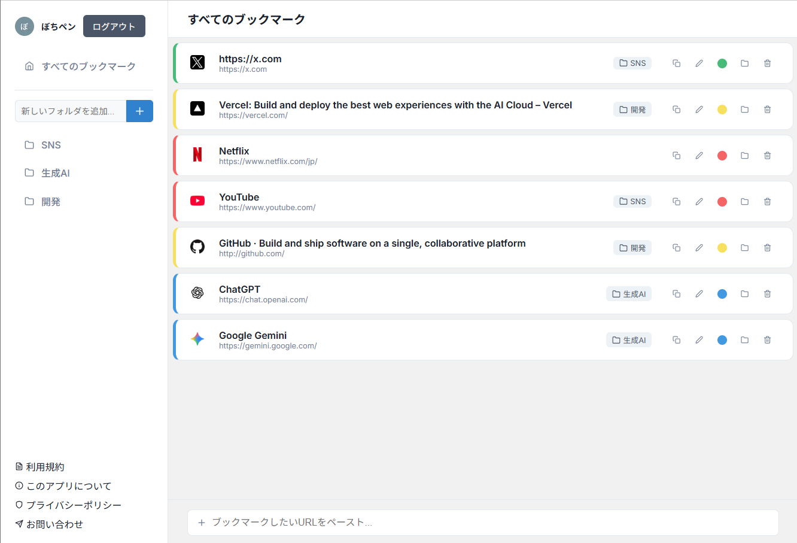

# 📚 PageShelf

**散らばる知識に、最高の「司令塔」を。**

PageShelfは、日々のリサーチや学習で出会う情報を、迷わず、素早く、美しく整理するためのインテリジェントなブックマーク管理ツールです。

 
## ✨ 主な機能

このアプリは、単なるブックマークツールではありません。あなたの情報収集を加速させるための、洗練された機能を多数搭載しています。

* **⚡️ 高速なOGPプレビュー**
    * URLをペーストするだけで、サイトのタイトルとファビコンを瞬時にプレビュー。保存する前に、どんなサイトかを確認できます。

* **🗂️ スマートなフォルダ管理**
    * ブックマークを直感的にフォルダ分け。サイドバーからいつでもフォルダの作成・名前の変更・削除が可能です。フォルダを削除しても、中のブックマークは安全に「未分類」に移動します。

* **🎨 直感的なUI/UX**
    * カード形式の見やすい横長デザインと、重要度や進捗が一目でわかる色分け機能。
    * 編集はページ遷移をしないポップアップ（モーダル）形式を採用し、操作の流れを止めません。
    * 全てのアクションにはToast通知でフィードバックがあり、操作の成功を確実に伝えます。

* **🔐 安全なパーソナル空間**
    * Supabase Authによる堅牢な認証システムを導入。Googleアカウントで簡単にログインでき、あなたのデータは安全に、あなただけのものとして管理されます。

* **📱 レスポンシブ対応**
    * PCの広い画面でも、スマートフォンの狭い画面でも、常に最適化されたレイアウトで快適に操作できます。

## 🛠️ 使用技術

このアプリケーションは、モダンなWeb開発のベストプラクティスを用いて、以下の技術スタックで構築されています。

* **フロントエンド:**
    * **Next.js (App Router):** Reactのフレームワーク。サーバーコンポーネントとクライアントコンポーネントを組み合わせ、高速でインタラクティブなUIを実現。
    * **TypeScript:** 静的型付けによる、堅牢でメンテナンス性の高いコードベース。
    * **CSS Modules:** コンポーネント単位でのスコープを持つ、クリーンなスタイリング。
    * **React Icons:** UIの視認性を高めるための、豊富なアイコンセット。
    * **React Hot Toast:** ユーザーへのフィードバックを伝えるための、美しい通知機能。

* **バックエンド & データベース:**
    * **Supabase:** オープンソースのFirebase代替。PostgreSQLデータベース、認証 (Auth)、APIをオールインワンで提供。
        * **Row Level Security (RLS):** データベースレベルでユーザーごとのデータアクセスを制御し、高いセキュリティを確保。
    * **Cheerio:** サーバーサイドでHTMLを解析し、OGP情報を抽出。

* **デプロイ & ホスティング:**
    * **Vercel:** Next.jsとの親和性が非常に高く、GitHubリポジトリと連携した簡単なデプロイと、高速なグローバルCDN配信を実現。

## 🚀 セットアップとインストール

このプロジェクトをローカル環境で動かすには、以下の手順に従ってください。

1.  **リポジトリをクローン:**
    ```bash
    git clone [https://github.com/bpen-dev/PageShelf.git]
    cd pageshelf
    ```

2.  **依存関係をインストール:**
    ```bash
    npm install
    ```

3.  **環境変数を設定:**
    プロジェクトのルートに`.env.local`という名前のファイルを作成し、SupabaseのプロジェクトURLと公開APIキーを設定します。
    ```
    NEXT_PUBLIC_SUPABASE_URL=YOUR_SUPABASE_URL
    NEXT_PUBLIC_SUPABASE_ANON_KEY=YOUR_SUPABASE_ANON_KEY
    ```

4.  **開発サーバーを起動:**
    ```bash
    npm run dev
    ```
    ブラウザで `http://localhost:3000` を開いてください。

---

この`README.md`が、あなたの素晴らしいプロジェクトの価値を、世界中の人々に伝える手助けになれば幸いです。
